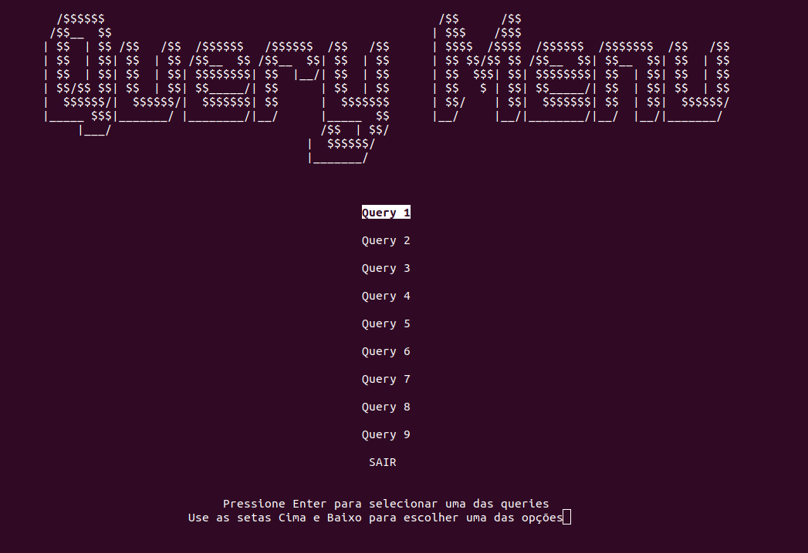
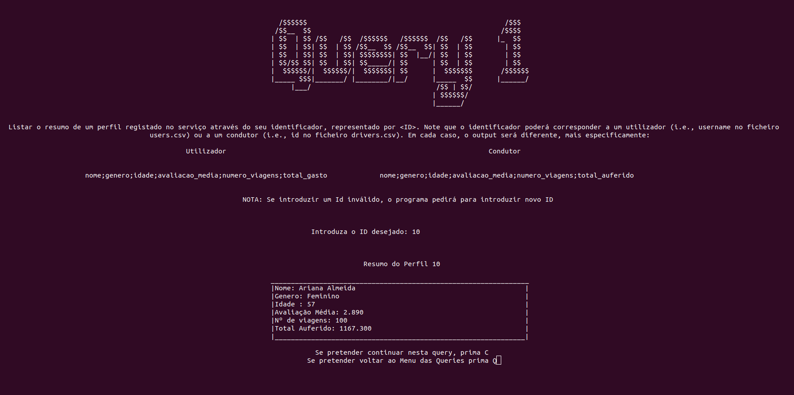
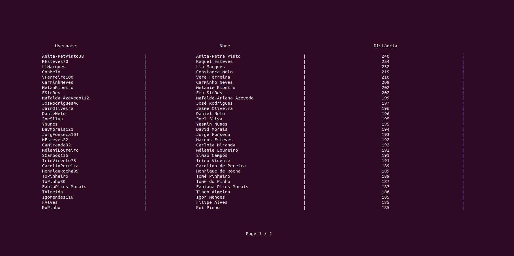

# LI3
I completed this project during my second year of studying software engineering at *Universidade do Minho* during my first semester.
The program is designed to read user, driver, and ride information from .csv files and provide answers to queries by combining data from all three files.

# How to Use

Firstly, the code must be compiled, which can be done using its makefile.
Secondly, there are two ways of running the program:

## Inputing the path to the queries files along with the path to the data (.csv) files:
        ./trabalho-principal <path_to_datasets> <path_to_queries_files>
    
## Only inputing the path to the data (.csv) files (interactive mode):
        ./trabalho-principal

**This is how the interactive mode menu looks like:**

**And this is how queries are answered:**

## Input Files

Users

users.csv

Columns:

    username
    name
    gender
    birth_date
    account_creation
    pay_method
    account_status

Drivers

drivers.csv

Columns:

    id
    name
    birth_date
    gender
    car_class
    license_plate
    city
    account_creation
    account_status

Rides

rides.csv

Columns:

    id
    date
    driver
    user
    city
    distance
    score_user
    score_driver
    tip
    comment
